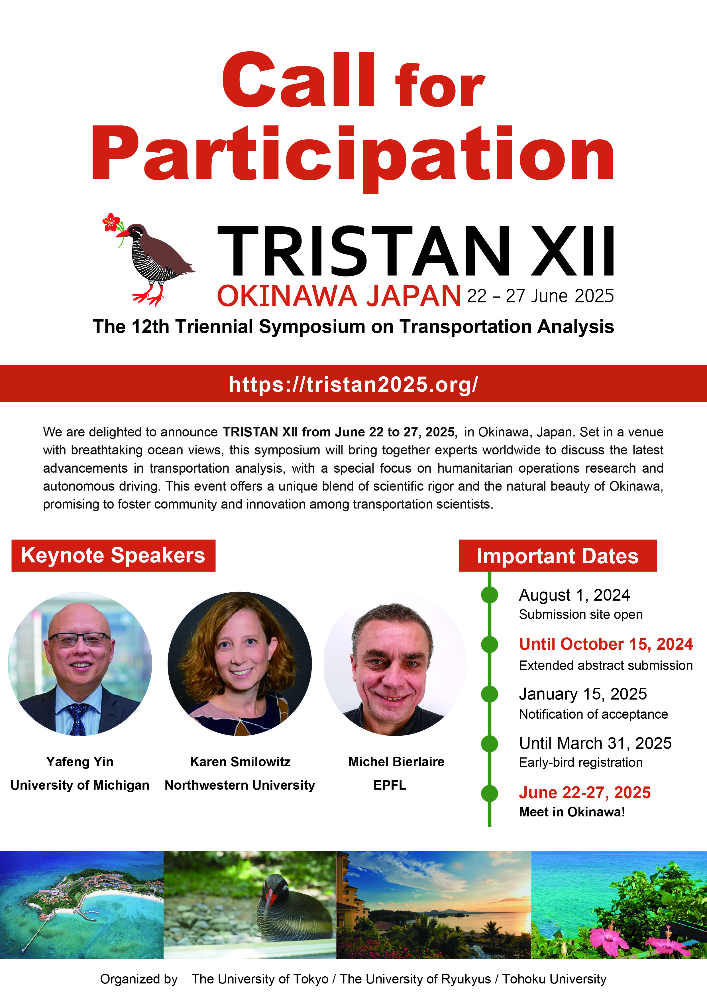

 

<!-- Please see below for a list of topics. -->
Selection for presentations at TRISTAN XII is based on the submission of extended abstracts of research.
Authors are welcome to submit more than one abstract. 
However, each registered participant is allowed to present at most one paper during the conference.

All submissions must be electronically submitted through the EasyChair conference manuscript management system.
https://easychair.org/cfp/TRISTAN2025

 

## Abstract Guidelines

Extended abstracts are to be written in English and should be no longer than 4 pages in length.
To facilitate the review and selection by the scientific committee, extended abstracts should clearly state the research goals, analysis methods, results, and contributions of the study.

Submissions should include the following details:

* Title
* Submission topic (as explained above)
* Up to 5 keywords
* Extended abstract
* References

NOTE: This submission is double-blinded. DO NOT include author names or affiliations.

Templates are provided to author papers in this format for both Microsoft Word and LaTeX:

{}**Microsoft Word Template** {} to prepare your paper for submission.

{}**LaTeX ZIP**{}, for online collaborative writing; authors can create an Overleaf project using this template.

 

## Important Dates

| Date | Event |
| ------------------| ------------------------------ |
| August 1, 2024 | Submissions site open | 
| October 15, 2024 | Extended abstract submission deadline (maximum 4 pages) |
| January 15, 2025 | Notification of acceptance | 
| February 15, 2025 | Submission of revised extended abstracts |
| March 31, 2025 | Early-bird registration deadline | 
|||

<!---
## Special Issue

The organizing and program committees are organizing multiple special issues for 2022 in association with TRISTAN XII with flagship journals in transportation and operations research. The information will be announced soon.
--->

 

## Scope and Topics
Submissions are welcome across a broad range of fields related to transportation systems analysis and transportation science. The scope of the conference includes, but is not limited to:

- Logistics and Freight Transport
  - Urban logistics, operative models, and applications
  - Road and rail freight, Maritime transport and ports, Air freight and airports
  - Freight-related decision-making process, policies and regulation
  - Freight behavior modeling using innovative data sources
- Operations Research Applications in Transportation
  - Continuous and Discrete Optimization
  - Decision Analysis, Decision Support Systems
  - Heuristics and Metaheuristics
  - Game theoretical formulations
- Traffic Flow Models, Network Assignment, and Transport Network Economics
  - Dynamic transportation models (Micro and Macroscopic level)
  - Network modeling, network equilibrium
  - Vehicle routing
  - Traffic Management and Coordinated Systems
- Travel Demand/Behavior Modeling
  - Advanced demand modeling, estimation and calibration techniques
  - Human behavior under uncertainties
  - Social network and interactions
  - Population synthesis
- Data Analytics, Learning, and Optimization in Transportation
  - Human mobility and travel pattern analysis
  - Anomaly detection in logistics/transportation systems
  - Data-driven decision-making
  - Advanced learning algorithms
- Humanitarian Logistics and Disaster Management
  - Robust, stochastic, and dynamic programming
  - Pre- and post-disaster operations
  - Non-profit operations, equity, and sustainability
  - Country-specific disaster management
- Modal transport  and management
  - Rail transport systems
  - Airport and air transport operations
  - Port and maritime operations
  - Intermodal Transport, Synchromodality, and Physical Internet
- Smart Mobility
  - Automated vehicles and Platooning
  - Network estimation and control using V2X communication
  - Green, Advanced and Automated Public Transport Systems
  - Micromobility Modeling and Management

<!--  --->