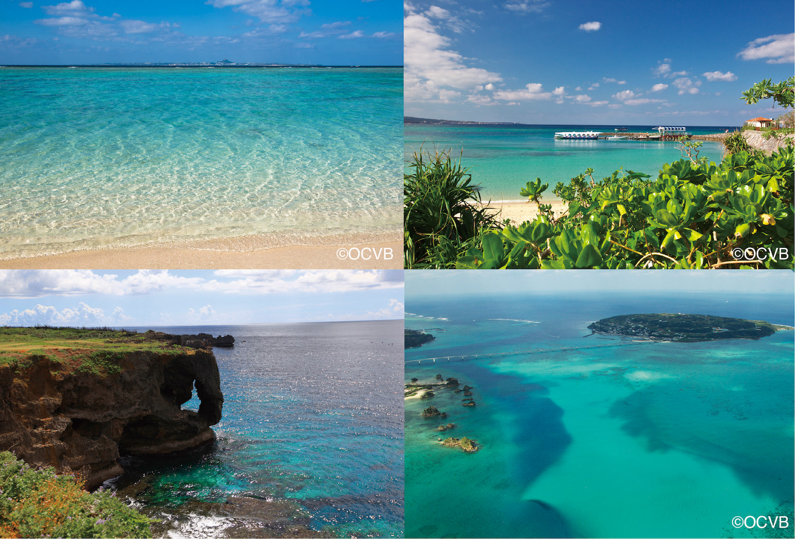

Okinawa island, located in the southernmost region of Japan, offers a captivating blend of natural beauty and rich cultural heritage influenced by its history of being an independent kingdom, then later becoming a part of Japan. We are delighted to host the TRISTAN symposium in Okinawa.

You can find an official travel guide to Okinawa at [VISIT OKINAWA JAPAN](https://visitokinawajapan.com/).

## Beaches around the venue
The conference venue is surrounded by a number of beautiful beaches. 
Busena Beach offers pristine white sands, clear turquoise waters, and vibrant coral reefs for travelers to relax and explore. 
"Manzamo", Okinawa's iconic cape, captivates with dramatic cliffs and panoramic ocean views, showcasing nature's breathtaking beauty.

<!--

     

         
     

     

         
     

-->

## Excursion
During the conference, we will organize enjoyable social tours.
The 'Croissant Island’ is just over two square kilometers, and mostly flat with swathes of forest and land cleared for cattle to graze. The island is hemmed by white sand beaches and encircled by coral reefs teeming with tropical fish and green sea turtles. We enjoy marine activities and BBQ! 

　<iframe src="https://drive.google.com/file/d/1oV6xmMct9k7j8t8PWRTf5MwCiilmE7wm/preview" frameboader="0"></iframe>

More information on excursion is coming soon!

<!--### Minna island-->
<!--### Okinawa Churaumi Aquarium and Ocean Expo Park
The aquarium introduces you to the mystery of Okinawa’s marine creatures, starting with the naturally lit Coral Sea tank, which exhibits a large selection of coral reef. Next is the enormous, dynamic Kuroshio Sea tank, where you can observe the world’s biggest fish as well as whale sharks and manta rays, which, in a world first, the aquarium has succeeded in breeding.-->

## Other attractors in Okinawa (to name a few)

### History and tradition of the Ryukyu Islands
Shuri Castle (Shuri-jō), located in Naha, Okinawa, is a historical landmark that once served as the palace of the Ryukyu Kingdom. Dating back to the 14th century, this castle is a symbol of Okinawa's distinct cultural heritage, blending Japanese, Chinese, and Southeast Asian architectural influences. Known for its striking red tiles and the iconic Shureimon gate, the castle showcases the unique Ryukyuan style. It functioned as the political and administrative center of the Ryukyu Kingdom for centuries. Shuri Castle has undergone several reconstructions due to wars and fires, including significant damage during World War II and a recent fire in 2019. Despite these challenges, the castle remains a testament to the resilience of Okinawan culture. 
<!--Today, as a UNESCO World Heritage Site, it attracts visitors worldwide, offering insights into the rich history and traditions of the Ryukyu Islands.-->

     

         
     

     

         
     

### Isolated islands surrounding Okinawa Island
Okinawa Prefecture is renowned for its beautiful and diverse islands, beyond the main island of Okinawa. These islands, each with unique charms, offer a glimpse into the rich culture and stunning natural landscapes of the region. These islands, along with many others in Okinawa Prefecture, provide a tranquil escape and an opportunity to experience the serene beauty and rich cultural heritage distinct to this part of Japan.
<!--Kume Island stands out for its unique geographical features, such as the Tatami Ishi, a striking rock formation resembling tatami mats. The island also boasts a rich history, evident in historical sites like Uegusuku Castle, which offers panoramic views of the island.
The Kerama Islands, a short trip from the main island, are a group of smaller islands like Tokashiki and Zamami, celebrated for their pristine beaches and excellent diving spots.
Ishigaki Island, part of the Yaeyama Islands, is famous for its crystal-clear waters and vibrant coral reefs It's also the gateway to the surrounding islands, including the picturesque Taketomi Island, known for its traditional Ryukyuan houses and star-shaped sand beaches.-->

     

         
     

     

         
     

### Mangrove forests
<!--Mangroves are predominantly located in the estuaries and along the coastlines where freshwater meets seawater, creating a unique habitat. The mangroves are distinguished by their dense root systems, which not only protect shorelines from erosion but also provide a breeding ground and nursery for various marine species, including fish, crustaceans, and mollusks.-->
Mangrove forests in Okinawa are not just ecological treasures; they are also culturally significant. They have been traditionally used in local industries, such as fishing and salt production. Today, these mangroves are popular among tourists for activities like kayaking and guided nature walks, offering a chance to explore and learn about these vital ecosystems. Their importance in carbon sequestration, especially in the fight against climate change, further underscores the value of preserving Okinawa's mangroves.

     

         
     

     

         
     

<!--
## Bankoku Shinryokan (The Conference Venue)

## Busena Terrace

<iframe src="https://drive.google.com/file/d/1JBAbJ1Z4h567CHwQ-A9c55RHkGwuatKX/preview" width="640" height="480" allow="autoplay"></iframe>
-->
